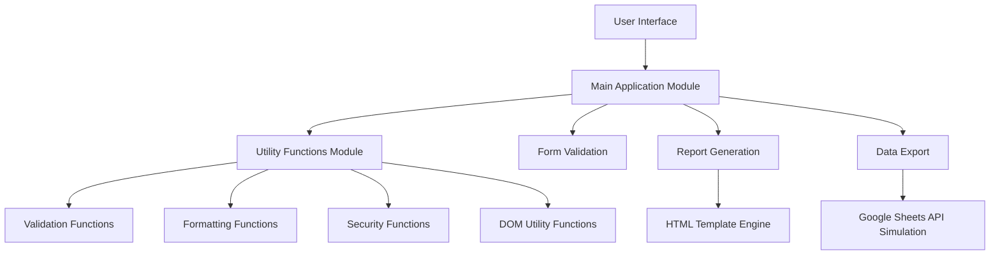

# Architecture Documentation

This document provides an overview of the system architecture and design decisions for the Medical Inspection Reports System.

## Table of Contents

1. [System Overview](#system-overview)
2. [Architecture Patterns](#architecture-patterns)
3. [Component Diagram](#component-diagram)
4. [Data Flow](#data-flow)
5. [Security Considerations](#security-considerations)
6. [Performance Considerations](#performance-considerations)
7. [Scalability](#scalability)
8. [Technology Stack](#technology-stack)
9. [Design Decisions](#design-decisions)

## System Overview

The Medical Inspection Reports System is a client-side web application designed for creating and printing medical inspection reports. The system allows medical inspectors to document their visits to hospitals and health centers, record any findings, and generate professional reports.

### Key Features

- Professional report generation with customizable templates
- Auto-complete system for inspectors, locations, and employees
- Print-ready report formatting
- Data export to Google Sheets (simulated)
- Responsive Arabic user interface
- Real-time form validation
- Keyboard shortcuts for enhanced productivity
- Comprehensive error handling and user feedback

## Architecture Patterns

### Modular Architecture

The system follows a modular architecture with clear separation of concerns:

1. **UI Layer**: HTML and CSS for presentation
2. **Application Logic Layer**: JavaScript modules for business logic
3. **Utility Layer**: Reusable utility functions
4. **Data Layer**: In-memory data structures

### Event-Driven Architecture

The system uses an event-driven approach for user interactions:

- DOM events for user input
- Custom events for application state changes
- Asynchronous operations for data handling

### Single Page Application (SPA)

The system is designed as a single page application:

- All functionality on one HTML page
- Dynamic content updates without page reloads
- Client-side routing for different views

## Component Diagram

## Data Flow

### Input Data Flow

1. User enters data in form fields
2. Data is validated in real-time
3. Auto-complete suggestions are provided
4. Form data is collected on submission
5. Data is processed and validated
6. Report is generated in HTML format

### Output Data Flow

1. Generated report is displayed in preview
2. User can print the report
3. User can export data to Google Sheets
4. User can clear the form

### Data Storage

The system uses in-memory storage:

- Form data is stored in JavaScript variables
- Predefined data is stored in constant arrays
- Generated reports are stored in DOM elements
- No persistent storage (data is lost on page refresh)

## Security Considerations

### XSS Prevention

- All user inputs are escaped before rendering
- HTML sanitization is applied to prevent script injection
- Content Security Policy (CSP) headers should be set on the server

### Input Validation

- Client-side validation for immediate feedback
- Server-side validation should be implemented if backend is added
- Regular expressions for format validation

### Data Privacy

- No personal data is stored on servers
- All data remains in the user's browser
- No tracking or analytics by default

## Performance Considerations

### Loading Performance

- Minimal external dependencies
- Optimized CSS and JavaScript
- Asynchronous loading where possible
- Lazy loading for non-critical resources

### Runtime Performance

- Efficient DOM manipulation
- Event delegation for better performance
- Memory management to prevent leaks
- Caching of frequently used data

### Rendering Performance

- CSS animations for smooth transitions
- Hardware acceleration for animations
- Minimal reflows and repaints
- Efficient CSS selectors

## Scalability

### Horizontal Scalability

As a client-side application, the system scales horizontally by:

- Distributing the application to multiple users
- No server-side bottlenecks
- CDN distribution of static assets

### Vertical Scalability

The system can handle increased complexity by:

- Modular code organization
- Efficient algorithms and data structures
- Memory management
- Code splitting (future enhancement)

## Technology Stack

### Frontend Technologies

- **HTML5**: Semantic markup and structure
- **CSS3**: Styling with Flexbox and Grid
- **JavaScript (ES6+)**: Modern JavaScript features
- **Web APIs**: DOM manipulation, Fetch API, etc.

### Libraries and Frameworks

- **Font Awesome**: Icons
- **Google Fonts**: Noto Sans Arabic font
- **No external frameworks**: Vanilla JavaScript for maximum performance

### Development Tools

- **npm**: Package management
- **serve**: Development server
- **nodemon**: Development file watching
- **ESLint**: Code linting (future enhancement)

### Testing Tools

- **Custom test framework**: Simple testing solution
- **Node.js**: Test runner environment

## Design Decisions

### Why Vanilla JavaScript?

1. **Performance**: No framework overhead
2. **Size**: Minimal bundle size
3. **Compatibility**: Works in all modern browsers
4. **Learning Curve**: Easy for new developers to understand
5. **Maintenance**: Fewer dependencies to maintain

### Why Arabic Language First?

1. **Target Audience**: Primary users are Arabic speakers
2. **Cultural Relevance**: Right-to-left layout and Arabic fonts
3. **Accessibility**: Better experience for Arabic-speaking users

### Why Client-Side Only?

1. **Simplicity**: No server setup required
2. **Privacy**: Data never leaves the user's device
3. **Portability**: Can run from any web server or locally
4. **Cost**: No hosting costs for server infrastructure

### Why Modular Architecture?

1. **Maintainability**: Clear separation of concerns
2. **Reusability**: Components can be reused
3. **Testability**: Modules can be tested independently
4. **Scalability**: Easy to add new features

### Why Comprehensive Documentation?

1. **Onboarding**: Easier for new developers to join the project
2. **Maintenance**: Clear understanding of system functionality
3. **Collaboration**: Better communication between team members
4. **Longevity**: Ensures project can be maintained over time

## Future Enhancements

### Planned Features

1. **Persistent Storage**: Local storage for saving drafts
2. **Template Customization**: User-defined report templates
3. **Multi-language Support**: Support for other languages
4. **Advanced Export**: Export to Word, Excel, and other formats
5. **Offline Support**: Full offline functionality with Service Workers

### Architecture Improvements

1. **State Management**: Implement a state management solution
2. **Component Library**: Create reusable UI components
3. **Build Process**: Add bundling and minification
4. **Type Safety**: Add TypeScript support
5. **Testing Framework**: Implement a more robust testing framework

## Conclusion

The Medical Inspection Reports System is designed with simplicity, performance, and maintainability in mind. The modular architecture and comprehensive documentation ensure that the system can be easily understood, maintained, and extended. The client-side approach provides privacy and portability benefits, while the modern technology stack ensures compatibility with current web standards.